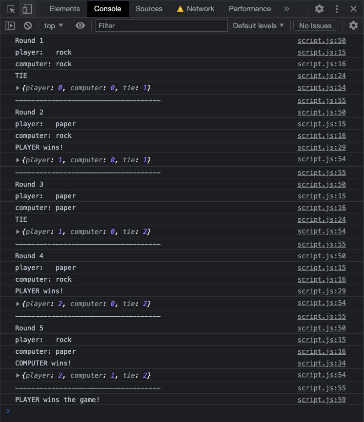

# odin-rps

This is a two-part project.

The aim of part 1 is to build a Rock Paper Scissors game that runs in the browser console.

More information: https://www.theodinproject.com/lessons/foundations-rock-paper-scissors

The aim of part 2 is to add a GUI (graphical user interface).

## Screenshots

#### Version 1 - Browser Console after 5 rounds played

## To-Do

- [DONE] create basic graphical user interface
- refine layout and graphics
- add animations ?
- add sounds ?

## What I learnt from this project

- Early design choices become harder to reverse once I start adding complexity on top. For example, I used the HTML table element to display scores and this was probably not the best choice as it limits the changes that can be made to spacing and layout.
