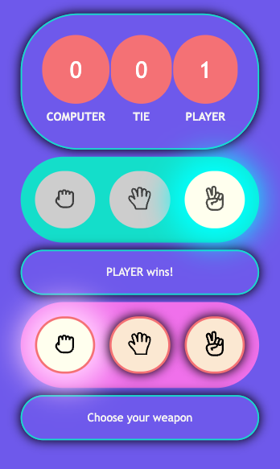

# odin-rps

Live: https://olzcodes.github.io/odin-rps/

This was a two-part project.

The aim of part 1 was to build a Rock Paper Scissors game that runs in the browser console.

https://www.theodinproject.com/lessons/foundations-rock-paper-scissors

The aim of part 2 was to add a GUI (graphical user interface).

https://www.theodinproject.com/lessons/foundations-revisiting-rock-paper-scissors

## Game Instructions

Play on mobile device using touch, or play using mouse/keyboard.

Keyboard shortcuts:

- Rock: [R] or [Q]
- Paper: [P] or [W]
- Scissors: [S] or [E]

- Toggle background color: [1]
- Toggle border color: [2]
- Toggle font: [3]

## Screenshots

#### Version 1 - Browser javascript console after 5 rounds played

#### Version 2 - Crappy design

#### Version 3 - Better design

#### Version 4 - Final design

#### Version 4 - Final design, showing button animations

## To-Do

- [DONE] create basic graphical user interface
- [DONE] refine layout and graphics
- [DONE] add animations
- [DONE] add sounds effects
- [DONE] toggle switches background color, border color, and font
- [DONE] add keyboard support
- add user accounts
- add betting functionality
- add payment methods
- just kidding about the last 3

## What I learnt from this project

- Early design choices become harder to reverse once I start adding complexity on top. For example, I used the HTML table element to display scores and this was probably not the best choice as it limits the changes that can be made to spacing and layout.
- Code can get messy very quickly. It is worth spending extra time on creating a good design and mapping out the user flows before writing any JavaScript.

## Credits

#### Images

- https://www.svgrepo.com/svg/314133/hand-rock
- https://www.svgrepo.com/svg/361516/hand
- https://www.svgrepo.com/svg/314121/hand-peace

#### Sounds Effects

https://mixkit.co/free-sound-effects/click/
